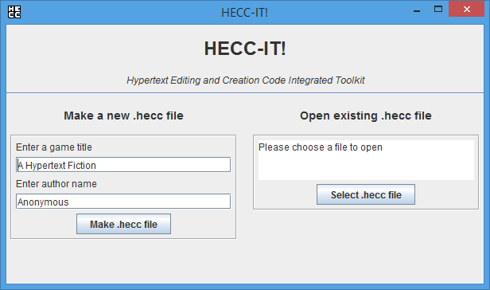
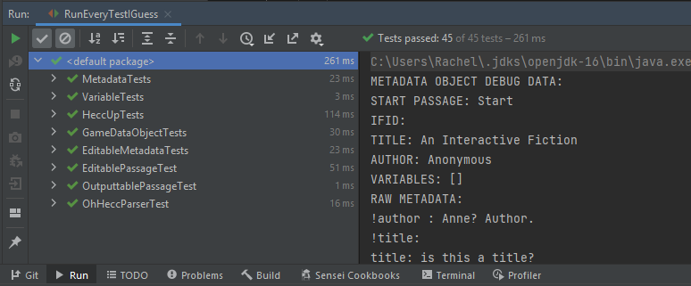

# 4.2: The Improvements to HECC-IT

Over term 2, I made several improvements to HECC-IT, with these changes being a mix of 'fully planned
out and documented' improvements, and some being 'realizations of a better way of doing things whilst
working on something else'.

## 4.2.1: The Planned Stuff

I didn't really document much on Jira that I explicitly set out to improve with HECC-IT itself, in fact,
the vast majority of the improvements that I made on it were 'spur of the moment' changes, made whilst
I was in the process of doing something else.

These documented changes were as follows:

* Incorporating HECC-UP and OH-HECC into one program
    * The 'I' in HECC-IT is supposed to stand for 'integrated', but having OH-HECC and HECC-UP as
      separate executable .jar files was not very 'integrated', so I wanted to make both of them
      part of a single executable, meaning I would need to work out some way of launching one with
      the other.
      
    * I chose to make the existing OH-HECC program into the 'main' HECC-IT program, which HECC-UP would
      become a part of.
      
    * The first thing I did was refactor HECC-UP.
      
        * Instead of the `HeccUpGUI` class having a single no-argument constructor which sets up a
          JFrame and the GUI, I rewrote it so the 'main' constructor for HECC-UP would take a JFrame as
          an argument, repurposing that JFrame for HECC-UP's GUI, just like the `OhHeccNetworkFrame`
          class (replacing the existing no-argument constructor with one that just calls this JFrame
          constructor, passing a new JFrame to it).
        
        * I rewrote the parts of HECC-UP that stored references to file locations as `File` objects to
          refer to them via `Path` objects instead, because OH-HECC (and the main menu of HECC-IT)
          used `Path` objects instead of `File`s (due to `File` being a legacy class), and I wanted to
          be able to pass the `Path`s directly into HECC-UP, and have them immediately interoperable.
          
            * I ran the HECC-UP component by itself after making these changes, and it still worked as
              expected with the `Path`s.
              
        * I created two more constructors for the `HeccUpGUI` class.
            * The first one would take a `JFrame` and a `Path` as an argument.
              
                * This would be called if HECC-UP was to be opened by the main menu of HECC-IT.
                * It would call the 'main' constructor of it with that `JFrame`, to set up the GUI.
                * The `Path` passed to it would be a `Path` to the .hecc file that the user would want
                  to export, so, this constructor would then call the `selectedAHeccFile` method (which
                  the logic that happens after selecting a .hecc file was moved to) in order to register
                  this `Path` as the selected .hecc file.
                * This constructor would then get the actual name of the .hecc file (from the `Path`)
                  as a String, and resolve a new `Path` which would be a subfolder of the directory
                  holding the .hecc file, with this subfolder having the same name as the .hecc file.
                  For example, if the hecc file was at `X://bruh/game.hecc`, the new Path would be
                  `X://bruh/game/`. This subdirectory Path would be defined as the chosen export
                  location for the game, via the `selectedAnOutputFolder` method (which the logic
                  that happens after selecting an export folder was moved to).
                  
                * The reason why this constructor pre-selects the .hecc file and the output directory
                  was so the author would not need to waste time selecting both of them individually,
                  as the OH-HECC code already selects/keeps track of a .hecc file. If an author
                  wants to, HECC-UP will still allow them to manually select a .hecc file/export
                  directory automatically. However, if they just want to export it and get it done,
                  they can do that.
                  
            * The second one would take a `Path` and a `Runnable` as an argument.
    
                * This would be called by the 'Export with HECC-UP' button in OH-HECC (which would
                  replace the 'Save and Quit' button).
                  
                * It would call the aforementioned `Path`+`JFrame` constructor of HECC-UP, passing the
                  given `Path` as the Path argument, and a new `JFrame` as the JFrame argument.
                  
                * It would then construct and add a `addWindowListener` to the `JFrame`, which would,
                  upon the `windowClosed` event, run the `Runnable` which was given to this constructor.
                  
                    * The passed `Runnable` would be a reference to the `editingWindowClosed` method
                      in the `PassageModel`, which is used to notify the `PassageModel` that a
                      currently-open editing window has been closed, allowing it to re-request focus,
                      and set the `activity` value back to `CurrentActivity.DOING_NOTHING`, allowing
                      the author to interact with the model again.
                      
                    * Basically, it's the same thing that the `PassageModel` passes to the passage/metadata
                      editor windows.
                      
    * I then reworked the `OhHeccRunner` and `ChooseFile` classes slightly, to turn `ChooseFile` into a
      main menu for 'HECC-IT'.
        * `OhHeccRunner` was renamed to `HeccItRunner`.
            * I also added another method to `HeccItRunner`, that method being
              `boolean openAndHeccUpFileAtLocation(Path heccFilePath)`.
              
            * This method would be given a `Path` to a .hecc file, and construct a `HeccUpGUI`
              using the `JFrame`+`Path` constructor (passing the given `Path` as one argument
              and the`HeccItRunner`'s JFrame as the other argument, so `ChooseFile` could be
              replaced with HECC-UP, within that frame, just like OH-HECC does it).
              
            * I also replaced the 'OH-HECC' text in the `JFrame` with 'HECC-IT'.
              
        * These are the changes I made to `ChooseFile`
              
            * I added a third parameter to `ChooseFile`'s constructor, of type `Predicate<Path>`,
              which would be used to pass a reference to `openAndHeccUpFileAtLocation` to
              `ChooseFile`.
              
            * The 'open existing hecc file' panel had another button added to it, which (again)
              would only be visible after selecting a .hecc file, but would open HECC-UP for that
              .hecc file instead.
              
            * The top text in the JPanel was changed to say 'HECC-IT' instead, to make it
              obvious that this was 'HECC-IT'.
                
            * I also removed the middle bar thing from the GUI, so I could get the 'create new
              hecc file' and 'open existing hecc file' areas of the GUI to be the same horizontal
              size as each other.
              
            * This is what the updated `ChooseFile` looks like:
        
                * ###### Figure(s) 41: The updated version of the 'ChooseFile' panel
            
                * 
    
                * 
              
    * Finally, I refactored OH-HECC's `PassageModel` to include the option to launch HECC-UP.
    
        * The 'save and quit' button was renamed to be an 'export with OH-HECC' button instead.
    
        * When pressed, it would attempt to save the .hecc file, and would then launch HECC-UP,
          using the `Path` + `Runnable` constructor (giving it the aforementioned `this::editingWindowClosed`
          method reference). Basically, it would operate the same way as the editor windows would.
          
        * However, there was a problem. It was still possible for OH-HECC to produce .hecc code which
          wasn't entirely valid (such as having passages with deleted links, or empty passages), which,
          upon being opened by HECC-UP, would result in it complaining, and the user getting frustrated
          at not being able to export their game. So, I needed to add some additional validation
          into OH-HECC.
          
        * I decided to adapt the routine used for saving the .hecc file to add an extra step: it would
          save the .hecc file as normal, but there would be an extra method in the `GameDataObject` which
          would save another .hecc file, with a `_lastValidVersion.hecc` suffix in the file name. This
          'lastValidVersion' would be the most recent version of the .hecc file which passed some automatic
          validation. If it fails validation, the most up-to-date .hecc file would still have been saved,
          but the 'lastValidVersion' will not be overwritten, and the user would be informed. The validation
          method will also throw a `HeccCeption` if it failed validation, allowing the problem to be shown
          to the author. HECC-UP would only be openable if the validation routine succeeded.
          
        * As part of the validation routine, it would first verify that there were passages, and that
          it actually had a start passage. Then, it would go through each of the passages in the
          passageMap, and would look at the status `PassageStatus` enum of each of them, throwing an
          appropriate `HeccCeption` if the status was not `NORMAL` or an `END_NODE`.
          
        * I realized that I didn't actually have any way of checking whether or not the content of the
          editable passage was empty, nor did I have any way of warning the user about this. So, I added
          another status to the `PassageStatus` enum; `EMPTY_CONTENT`. The method that would update
          the status of a passage would be updated to first check if the passage was entirely whitespace,
          assigning the `EMPTY_CONTENT` status if this was the case. I also updated the recolouring code
          for the `PassageObject` within OH-HECC to make the `PassageObject` turn dark orange if it had
          an `EMPTY_CONTENT` status, allowing the user to easily see it at a glance.

* Idiotproofing the passage content/multiline comment input boxes
    * OH-HECC initially did not prevent an author from writing lines within a passage content/passage
      multiline comment that were passage declaration lines (starting with `::`) and were multiline
      comment declaration lines (consisting of `;;`).
      
    * Because this could lead to invalid .hecc code being produced by OH-HECC, these inputs needed to be
      prevented.
      
    * I rewrote the `setPassageContent` method of the `EditablePassage` to call a new private method,
      called `sanitizeContent`, which would put an `\` before any `::`s or `;;`s at the start of a line
      in the given passage content string, returning the sanitized string. Technically, it puts two `\`s
      before these; the first `\` is there to escape the `\` which is being used to 'escape' the `::`s
      and `;;`s. Both of these `\`s had to be escaped themselves to be put into the replacement
      string in the first place, which is why it looks like it inserts four `\`s in there.
      
    * I unit-tested this by adding a test for this in the [EditablePassageTest](../src/oh_hecc/game_parts/passage/EditablePassageTest.java)
      unit-test class, and it worked as expected, escaping the `;;`s and `::`s at the start of lines,
      and leaving any others untouched.
      
* Fixing a problem where all but 1 of the links to a child passage would not update when a child
  passage was moved, but only updating if the parent passage's position was updated.
    * In OH-HECC, when moving a passage, the link objects that point to/from that passage are supposed
      to be updated, such that these passages are still visibly connected. However, I noticed an unusual
      bug where, if a passage had multiple parents, all but one of the parent links would cease to
      update with the position of this passage upon it being moved, but would only update if the parent
      passage was moved.
      
    * For context, when moving a passage, the link objects (the 'links') are updated as follows:
        * All of the current passage's links to other passages are updated.
        * The passages which link to the current passage (having the current passage's UUID in their
          set of linked passages) are found by the `PassageModel`.
        * For each of these parent passages, their `updatePositionOfSpecificLink` method is called,
          with the UUID of the current passage being given as an argument for that method, so the link
          to the passage which is being moved is obtained (as these link objects are held within a map,
          with the UUIDs of the passages they link to being the keys), and that one object is updated.
        * I chose to implement the 'updating other passages' in this way, so I wouldn't be wasting
          computational resources on updating the links which hadn't been changed, which, for a game
          with a lot of links, could get out of hand very quickly.
          
    * After some further investigation, I realized that the links would work as expected until the
      'save' button was pressed, after which they would break, so I would need to investigate the save
      routine to see if that had anything to do with it.
      
    * As mentioned earlier, I used a recursive depth-first strategy in the save routine, keeping track
      of unvisited passages, so I don't end up getting into an infinite loop. As part of this routine,
      the set of linked passage UUIDs for a passage would be obtained, and everything but the
      'unvisited' passage UUIDs would be omitted from this 'linked' set, before going through the
      'linked' set to attempt saving them.
      
    * The problem was that the save routine obtained a shallow copy of the linked UUIDs, not a deep
      copy; the previously-visited passages would be removed from the **actual** linked UUID set for
      a passage, instead of from a copy of it. So, when the `PassageModel` would be looking for the
      parent passages of a given passage later on, it wouldn't notice the parent passages that had
      their link to the currently-moving child omitted, so those links would be left dangling.
      
    * By changing the line of code in the 'save' routine to obtain a copy of each passage's linked
      UUID set (via `new HashSet<>(sp.getLinkedPassageUUIDs())`), this problem was fixed.
      
* Refactoring the `Model` to inherit from `JComponent` instead of from `Canvas`
    * `Canvas` is an `java.awt.*` class, and is a 'heavyweight' GUI component (unlike
      `javax.swing.JComponent`, a 'lightweight' GUI component). Additionally, combining AWT
      and Swing components within a GUI is heavily discouraged. Therefore, I refactored
      the `Model` class to inherit from `JComponent`, a swing component, instead.
      
    * In hindsight, this may not have been a good idea. However, it did mean I could eventually
      omit the `View` class from being used, as I did change the `OhHeccNetworkFrame` to store the
      `View` as a `JComponent` instead. So, as the `View` was showing a single `JComponent`, and as
      it was, itself, being used as a `JComponent`, that made sense.
      

Another bug I documented and dealt with was a problem where the passage content could get parsed
as the line end metadata. I managed to fix it in a rather quick-and-dirty method by splitting the given
'lineEndMetadata' string at the first line break within the constructor for the passage data objects,
and discarding everything in that string which was after that line break. It isn't elegant, but, as
the 'lineEndMetadata' string was only intended for the passage declaration line metadata (not for the
content, which was in a different string), it was sufficient.
      
There was one bug I wanted to get fixed which I didn't manage to document getting fixed. This one
involved the model itself not automatically repaint itself after an editing window was closed.
I eventually managed to fix this in one of the many undocumented improvements, most likely the one
which involved the removal of the redundant `View` object (allowing the `Model`'s `repaint` to call
back to the `repaint` method of the frame holding it).

One improvement I had documented intent to make, which I didn't actually make, was some form of
'passage search' functionality for OH-HECC, allowing the user to navigate to a certain passage of
their choosing. This was left unimplemented mostly because I couldn't decide how to actually present
this option to the user. I could relatively easily use Streams to filter the `objectMap` for passages
that have a given name/given tags, and I could have potentially automatically moved the viewport to
put the currently 'found' passage in the middle of the viewable area. However, I wasn't sure how
to allow the user to make use of this search stuff. I considered opening another JFrame with a text
input field and some JButtons that could be used to navigate through the 'results' found, but, that
solution would have been a bit too unwieldy for an author to want to use it, and the author would
probably be able to find it a bit more efficiently if they were to just look at the .hecc file itself.

## 4.2.2 The undocumented changes to HECC-IT.

The other improvements to HECC-IT were not explicitly created as issues on Jira, but, instead,
were mostly made as spur-of-the-moment changes, whilst working on another task (with many usability-
related improvements being made during the creation of *Backblast*, and several of the 'I've just
realized how to do this/found a better way of doing this'). Therefore, I have divided this section
into a 'user experience' section, and a 'behind-the-scenes' section.

### 4.2.2.1: HECC-IT User Experience

* Changed the `done` ('Save and Exit') buttons at the bottom of the `PassageEditorWindow` and
  `MetadataEditorWindow` to save the updated inputs into the `PassageEditingInterface` and
  `MetadataEditingInterface` objects themselves, before closing the window. If any of the inputs fails
  validation, the user will be notified, and that window will not be closed. This change was made
  because I couldn't be bothered to keep individually clicking each 'update *x*' button before I
  closed the editor windows.
  
* Added a red outline to any passages in the `PassageModel` that have a `noreturn` tag. I did this via
  a method in the `PassageEditingInterface` which would return true if it had `noreturn` within its tag
  list, and, if it was true, a boolean attribute of the `PassageObject` would be set to true. This
  would cause a red rectangle (an outline) to be shown around the `PassageObject` in the draw operation.
  This change was made because I was starting to get confused between what was/wasn't a point of no return.
  
* Added some very nice icons for the JFrames within HECC-IT, with variations for HECC-UP (whenever the
  HECC-UP JFrame is displayed) and OH-HECC (used whenever the OH-HECC icon is displayed). This was
  done because I was sick and tired of seeing the generic default JFrame icons all the time.
    * These icons are image files, stored in [src/assets/imageAssets](../src/assets/imageAssets).
    * They are imported via `getResource` so they can be included in the final .jar, 
      and are stored within [utilities/ImageManager](../src/utilities/ImageManager.java).
    * Specifically, they are stored in `List<Image>`s, because the `setIconImages` method of the
      `JFrame` class takes a list of `Image`s (and/or subclasses of `Image`s) as an argument, with
      this list consisting of icon images of different sizes, for use in different parts of the `JFrame`.
    * The very small, square, `HECC` icon is for the top-right corner of the `JFrame`s. It's 16px by
      16px, which is the largest possible size for these icons, so, even though it's barely readable,
      it's the best that I could do.
    * The other icons are intended to be used as system tray icons (of 32\*32, 64\*64, and 128\*128
      pixels).
    * The `setIconImages` method is called by `HeccItRunner` with the `HECC_IT_IMAGES` list, to give
      the frame some 'HECC-IT' icons. The `OhHeccNetworkFrame` calls this method again with the
      `OH_HECC_IMAGES` list (for 'OH-HECC' icons), and the `HeccUpGUI` also calls it, with the
      `HECC_UP_IMAGES` list (for 'HECC-UP' icons).
      
* Changed the way that the `PassageObject`s are rendered. They are now shown using the `fill3DRect`
  method of `Graphics2D` instead of simply being rendered as a flat 2d rectangle. This change was made
  because I wanted the `PassageObject`s to have a border so I could tell which was which when there
  were two that were slightly layered on top of each other, however, after trying a simple 1px
  rectangle outline (via the `draw` method of `Graphics2D` using the fill area), that border was a bit
  too noticeable, and I wanted a more subtle border. However, the `fill3DRect` method draws a filled
  rectangle as if the corners are beveled and lit from the top-left, which, in practice, means that
  they have a very nice and subtle outline.
    * I still use the `fill` method with the fill area to draw the overlay colour if a `PassageObject`
      is selected, because that's just an overlay. Additionally, the `noreturn` border is still drawn
      via the `draw` method of the fill area, because that still needs to be made immediately
      noticeable. In fact, by using this variety of border by default (instead of the solid border),
      this actually makes it more obvious if a particular passage is a 'point of no return'.
      
* Adding some error correction code into the OH-HECC parser, in case there are minor problems with
  the supplied .hecc code, so, if an author provides completely stupid .hecc code, OH-HECC can mitigate
  the problems and even fix a few of them automatically.
    * If there are multiple passages with the same name, the duplicates will have a number appended to the end of their
      names, to make them unique.
        * This number is added in the form of a counter. Suppose that three passages were called `bob`; 
          the first one would remain as `bob`, the second one would be renamed to `bob_1`, and the third one would be 
          renamed to `bob_2`.

        * If you had passages in the .hecc file called `james_1`, `james`, and `james`, you would end up with `james_1`,
          `james`, and `james_2`, as expected.
      
        * However, if you already had `kevin`,`kevin`, and `kevin_1` (with `_1` being after both `kevin`s), the `kevin`
          passages would be incremented as usual, however, upon approaching `kevin_1`, it will notice that there already
          is a `kevin_1` (due to a kevin being incremented), so the original `kevin_1` itself be renamed to `kevin_1_1`.
          
        * This automatic renaming does have a chance of breaking the passage links, if the author wanted the links to
          link to the `fred` which got renamed to `fred_1`. However, in this case, I would argue that it's the author's
          fault for having multiple passages called `fred`, meaning that OH-HECC had no idea which `fred` those passages
          were supposed to link to.

      * If there is no start passage, one will be created.
    
          * It holds a boolean `foundStart` value, and, whilst going through the passages, until `foundStart` is true,
            it will keep comparing the `trimmedName` string (produced after a duplicate passage is renamed) with the
            metadata's `getStartPassage` string, and, if a match is found, `foundStart` is set to true.
    
          * After it's finished going through the passages, if `foundStart` is still false, it will create a new passage,
            with the name identified in the `getStartPassage` string, and adds it to the passage map.
            
    * If there are passages which contain links to other passages which don't yet exist (after the renaming of
      duplicates/adding of the start passage), the passages which they link to will be created.
        * This is checked by attempting to call the `updateLinkedPassages` and `updateLinkedUUIDs` methods of each
          `PassageEditingInterface`, and seeing if the linked names set and linked UUIDs set for that passage are the
          same size as each other; if they are not the same size, that means it references a named passage which isn't
          in the passage map.
          
        * When doing the iteration through the passages to get the `updateLinkedUUIDs` call, we will add the name of
          the current passage to a set of strings for passage names that definitely do exist. If the count of linked names
          and linked UUIDs for a passage are different, we add that passage to the list of `unresolved` passages, and
          we add all of its linked names to the set of passage names that might not exist.
          
        * Once we are done with that iteration, we remove the 'these exist' passage names from the set of 'might not exist'
          passage names, via the `removeAll` method of the `Set<T>` interface. The remaining 'might not exist' passages
          are now 'definitely don't exist' passages.
          
        * We then create these passages that don't exist, and add them to the passage map. Once that is done, we update
          the linked UUIDs of the passages that didn't successfully have their linked UUIDs updated earlier on, now that
          the passages they are trying to link to exist.
          
    * If a passage has no position defined for it, OH-HECC will attempt to give it a position automatically.
    
        * The default position that any passage that doesn't have a specified position will have is always (0,0). The
          problem with this is that, if every single passage doesn't have a position defined in the .hecc code, all of
          these passages will end up directly on top of each other, which could get awkward for a user to deal with.
          
        * So, after the OH-HECC parser is done constructing all the passage objects/adding passage objects that needed
          to be added/etc, it will go through all of the `PassageEditingInterface` objects one final time. The only
          `PassageEditingInterface` object that will be allowed to have a position of (0,0) will be the start passage.
          
        * For all the other passages that have a position of (0,0), it will attempt to find the position of a 'parent'
          passage of it which is not at (0,0). Once this is done, the passage's position will be offset from that parent
          passage's position (if one could not be found, it will be offset from (0,0)) by a random distance in a random
          direction.
          
        * The end result of this will be that the passage objects in the editor will be scattered around randomly, in
          a bit of a barely-organized pile of mess. But at least it means that the passage objects won't all be piled
          directly on top of each other (meaning that the author would need to manually drag each and every passage
          out of the pileup individually).
          
    * These error-correction features have all been unit-tested in the [OhHeccParserTest](../src/oh_hecc/OhHeccParserTest.java)
      class (or, in the case of the passage position error correction, I have ensured that the non-start passages are
      all moved to a position which is not (0,0)), so I know for sure that these do work.
      
* The user can also scroll the view in the OH-HECC passage view by holding their right mouse button on the passage view
  and 'dragging' it. The passages will basically stay at the same relative position as the mouse cursor, so, to a user,
  it'll look (and potentially even feel) as if they're physically dragging the model around, which should, at very
  least, feel not entirely terrible. I made this change because I was starting to get frustrated with only being able
  to move the passage map by increments of 100px in each of the 4 cardinal directions using the arrow keys.
  
    * Firstly, I probably should mention a few changes I made to the existing scrolling code. I added in a
      `requestFocus()` call on the JFrame belonging to the `OhHeccNeworkFrame` in its `finishSetup` method,
      which ensures that any keypresses from the user will be picked up by the `ModelController` which was added
      as a KeyListener to the that JFrame, without requiring the user to click on the model/open and close a component
      editor window, or anything else along those lines beforehand.
      
    * For both scrolling methods, I added in a 'boundary' of sorts for the scroll. Within the `revalidate` method of
      the `PassageModel` (called after any user input event is processed), I create a 'minXY' and 'maxXY' Vector2D,
      to hold the lowest and highest X and Y passage object positions. I then go through the `values()` in the
      `objectMap`(the clickable passage objects), via the `ObjectWithAPosition` interface (which just has a
      `Vector2D getPosition()` method), specifically, using an `Iterator<? extends ObjectWithAPosition>`. I initialise
      minimum/maximum to be copies of the position value held in the first passage object in the map. I then use the
      iterator to iterate through those `ObjectWithAPosition`s, and obtain the lower/upper x and y bounds for the
      positions of these objects. I also obtain a vector which represents half of the width/height of the component.
      After the lower/upper bounds have been obtained, I subtract this half-size vector from them, such that these
      bounds are offset to be applicable to the top-left corner of the screen. Then, I use the `ensureThisIsInBounds`
      method of the `topLeftCorner` method, given the calculated x/y bounds vectors as arguments, to forcibly
      ensure that it is within those bounds. This has been done so the user can't get too lost from their passages
      (unless, of course, there's one passage that's really, really far away from all the others in one particular
      diagonal, in which case, the user would probably be better off saving the .hecc file, closing OH-HECC, and
      editing the .hecc file to manually move the passage to a more sensible location).
      
        * If there are no passages in the `PassageModel` (somehow), the viewport will be fixed such that (0,0) is in
          the midpoint of the viewable area. Additionally, if there is only one passageObject in the `objectMap`,
          it will not be possible for the viewport to be scrolled away from that passage (at least, until another
          passage, in a different position, is added to the model)
      
    * The actual 'drag to scroll' logic is implemented in a very similar way to the 'dragging passages' logic.
      The `PassageModel` has had a `Vector2D currentRightDragPos` attribute added to it, to keep track of the last
      right mouse position (like the `currentLeftDragPos` vector).If the`activity` value of the `PassageModel` is
      currently `CurrentActivity.DOING_NOTHING`, and the user right-clicks the `PassageModel`, the `activity` becomes
      `CurrentActivity.RC_MOVING_VIEW`, and the `currentRightDragPos` is set to the position of the mouse. Then, when
      the mouse is dragged whilst the right mouse button is held, I obtain the `Vector2D` difference between the mouse
      positions in the same way as I did for the left mouse drag logic. However, unlike the left mouse drag stuff, I
      do not offset the mouse position by the current amount of scrolling because, if I were to do that, things would
      get out of control very easily (because the thing that dictates how much it will scroll would itself get messed
      up by the scroll and things would get weird). I still update the `currentRightDragPos`.
      Then, I double-check that the current activity is, in fact `CurrentActivity.RC_MOVING_VIEW`. If this is the case,
      I get the difference between last frame's right mouse position and the current frame's right mouse position, then
      I subtract (not add) that from the `topLeftCorner`. It's subtracted instead of added because, unlike the 'moving
      the mouse' operation (where the object must follow the mouse), I need to move the viewport in the opposite
      direction of the mouse movement, which in turn gives the impression that everything that is being viewed is
      following the mouse instead. This is followed by a `revalidate()` call, which handles keeping the viewport
      in bounds, before the frame is repainted.
      
    * The `activity` will be reset to `currentActivity.DOING_NOTHING` as soon as the user releases the right-mouse
      button. This is so there won't be any awkward situations where the user is trying to scroll the viewport and also
      move a passage/change stuff with the passage map at the same time. The button-based scrolling methods still are
      present and are usable (and have also been edited to accept the numpad arrow keys as well as the normal arrow
      keys), but are now only usable if the `PassageModel` is in the `CurrentActivity.DOING_NOTHING` state.
      
* The outputs received a few other minor improvements as well: the author, game title, and IFID are now included in
  the `hecced.js` file (in some comments at the top of the .hecc file, all of which are comments in the form `//`,
  so there's no way that a user could accidentally-on-purpose forcibly escape them). Additionally, the 'author'
  metadata is present within the index.html file as well (via a `<meta name="author" content="author name goes here">`
  tag, with the author name automatically filled in by HECC-UP, with html escape characters as well).
  
* Additionally, the passages are added to the `hecced.js` file via a recursive depth-first traversal (similar
  to the save routine within OH-HECC), however, this is just used to obtain a set consisting only of the names of
  the passages that are actually connected back to the 'start' passage, so the completely unconnected 'orphan'
  passages won't be output (only these connected passages). If this recursive method fails due to a stack
  overflow error, it will simply use the set of all passage names instead. It then iterates through that set of
  passage names to obtain and output the corresponding passages onto the .hecc file. This has been implemented so,
  if an author has been using unconnected passages as a means of taking notes, they won't have to worry about
  those passages appearing in the output, in case they don't want the reader to have any way of viewing them.
  This functionality can be seen in action (along with tests for HECC-UP's validity checking) within [`src/hecc_up/HeccUpTests.java`](../src/hecc_up/HeccUpTests.java).
  All of these tests do pass as expected.
      
Finally, this technically probably doesn't count as a 'user experience' feature, but I have been trying to make
the inner workings of HECC-IT much more efficient (using more interfaces instead of the full objects, explicitly
re-declaring every single local variable which was not modified after declaration as `final`, omitting several
methods that went unused, etc.) but that's probably more suitable for the next section.

### 4.2.2.2: HECC-IT behind the scenes

This is the fun part.

#### 4.2.2.2.A: The overall architecture

The game data classes have been considerably rewritten.

##### Figure 42: An updated class diagram for the game data classes

HECC-UP's `Passage` class has been completely deprecated. Instead, I changed the `EditablePassage` class within
OH-HECC to inherit from a `GenericPassage` object, with a new `OutputtablePassage` subclass being created
for it, which is used by HECC-UP. I chose to do this because it meant that I would have all the code responsible
for the things used by OH-HECC and HECC-UP (being the passage name and content strings, as well as the set of
linked passage names and the list of passage tags) safely encapsulated together in a class, minimising code
duplication. This also meant that the `src/hecc_up/gameParts/Passage` class is now completely deprecated,
so it has been annotated as such in the code. HECC-UP accesses this `OutputtablePassage` via the `OutputtablePassageInterface`,
because `AbstractPassage` still implements from `SharedPassage`, which has a few getters that go completely
unused by HECC-UP, so the `OutputtablePassageInterface` is used to only expose the getters which are actually
of use. It also exposes a `getHECCED()` method, which is used to  HECC-UP's `Metadata` class is still used, and is present in the above class diagram, implementing the
`MetadataReadingInterface`, because that interface contains all the important regexes for metadata used by both
parts of the system, and there are only two unnecessary getters within `MetadataReadingInterface` and `SharedMetadata`
in the context of HECC-UP (these being the `getComment()` and `toHecc()` methods; the implementations of these
in `SharedMetadata`) which are overridden to simply return an empty string. The `PassageOutputtingLinkChecking`
interface exists to be used within the recursive `getNamesOfAllNonOrphanPassages` method within the
`hecc_up/HeccParser`class, as that interface only exposes the methods that are actually needed in that method.
The `FolderOutputterMetadataInterface` is still present here, still in `src/hecc_up`, and is still only used by
the `FolderOutputter`. The rest of these classes are all only used in the `OH_HECC` code. These can be seen
below.

##### Figure 43: A class diagram for the updated game data classes, showing dependencies

The `GameDataObject` now actually implements the `MVCGameDataInterface`, and the `PassageModel` now accesses
the game data via the `MVCGameDataInterface`. The `View` class has been made redundant, due to the `Model`
extending `JComponent` anyway, so that is no longer present between the `OhHeccNetworkFrame` and the `Model`.
Because the `Model` is passed to the `OhHeccNetworkFrame` as a `JComponent`, part of the existing Java language,
this doesn't show up on the automatically generated class diagram above (and there's no way to add it without
basically adding the rest of `javax.swing.*` to the class diagram, which would get rather messy).
The passage/metatata/editor classes/interfaces which are not used directly by OH-HECC have been omitted
(including the editor window subclasses, as they are only accessed via the `EditorWindowInterface`). The raw
`EditableMetadata` and `EditablePassage` classes are still shown here, despite only being referenced via
interfaces, because I still wanted to show where the instances of these classes could be created.

The `HeccItRunner` is still the entry point to the program, and is still responsible for initially instantiating
everything. `ChooseFile` has remained the same. The `OhHeccParser` now implements a `GameDataGetterParserInterface`;
initially the `GameDataObject` would need to be instantiated by having a passage map, a `MetadataEditingInterface`,
and a Path passed to it, with former two being individually obtained from the `OhHeccParser` by the `HeccItRunner`
when constructing the `GameDataObject`. This was a bit longwinded, so I created the `GameDataGetterParserInterface`,
which only exposed the methods of the `GameDataObject` which get the passage map and the editable metadata. I added
a constructor to the `GameDataObject` which took an instance of that interface (along with a path) as arguments,
and that constructor would handle the getting of that data itself, meaning that was one less thing the `HeccItRunner`
would have to do.

I suppose I should mention what the other new `Passage`-related interfaces are used for.

* `UpdatableLinkedUUIDsInterface` is used for the loops where the linked UUIDs of the `EditablePassage`s need to be
  updated. It only exposes one method; `updateLinkedUUIDs(Collection<? extends SharedPassage> allPassages)`,
  which finds the passages in the set which have the names in this passage's linked names, and adds their passage
  IDs to this passage's set of linked UUIDs. This method has been refactored a bit since the MVP, because it
  initially went through a `Map<UUID, ? extends SharedPassage>`, but, as it would always be iterating through the
  `.values()` collection of the argument, I realized that I could make it more efficient and generalized by just
  giving it the collection of `? extends SharedPassage` in the first place.

* `ModelBitsPassageInterface` is a version of the `PassageEditingInterface` for use in the `PassageObject` within
  OH-HECC's `model_bits` package. These methods are the getters for the UUID, passage name, passage status, linked
  UUIDs, whether or not it's a point of no return, as well as the getter + setter for the passage's position.
  The `PassageObject` now holds one of these, and this change was made to get rid of the overhead caused by the
  `PassageObject` having access to so many completely methods in the `PassageEditingInterface` which it doesn't
  use.

* `PassageModelEditablePassageInterface` is an interface for `PassageEditingInterface` which only exposes the
  methods of the `PassageEditingInterface` which regularly need to be accessed by the `PassageModel`. In practice,
  it just extends `UpdatableLinkedUUIDsInterface` and `ModelBitsPassageInterface`, not exposing any other methods.
  Ideally, I would replace all instances of the `PassageEditingInterface` in the `PassageModel` with the
  `PassageModelEditablePassageInterface`, however, because I still have the passage map of the `MVCGameDataInterface`
  still very tightly coupled with the `PassageModel`, I have not yet gotten around to doing this. I am feeling very
  tempted to just refactor it right now, as of the time of writing this, but that would probably just delay
  this report even further.
  
On that note, I should probably discuss the changes made to the MVC model_bits classes.
Below are some class diagrams, firstly one showing the inheritance-based connections between
the model_bits (with full details about them), then another one showing all all of the classes
involved in the MVC side of things, and then another one showing the dependencies between them.

##### Figure 44: A full class diagram for the 'model_bits' package (and a couple of related classes)

##### Figure 45: A class diagram showing the inheritance-related relationships between the MVC classes

##### Figure 46: A class diagram showing the dependencies between all the MVC classes

As you can see from the top half of the first diagram, the `ModelButtonObject` is no longer a subclass
of the `EditModelObject`, because it no longer needed a reference to the `EditModelInterface`
for the resizing code (with the passage model calling the resize method of the
`ModelButtonObject`s automatically when it gets resized, via the `resize` method within the
`ResizableObject` interface which they implement). You might also have noticed all of
the interfaces which have been added to the `model_bits` classes; Most of these are intended
for use in various methods/loops/etc through the collections of these objects, where not all
of the methods in those objects are actually needed, for the sake of efficiency. Additionally,
many methods in these classes which went completely unused have been discarded completely,
once again for the sake of efficiency.

The `StartHighlightObject` now stores the object it is 'highlighting' as an `ObjectWithAPosition`,
as the only thing it needs from that other object is the position of it. The `PassageLinkObject`
also stores the `PassageObject` is links 'from' as an `ObjectWithAPosition`, however, that
object is passed to it as an `ObjectWithPositionAndUUID` so it can actually obtain the UUID
of the source object within the constructor, so it can find out if it's a link between a
passage and itself (in which case, it simply won't bother doing anything in the `draw` method,
because that link would be completely hidden underneath that `PassageObject` anyway). The
`drawableObject` interface (and other such interfaces with the word 'drawable' in their names)
are here to only expose the `draw(Graphics2D g)` methods of these objects (or, in the case
of the interfaces that extend that interface, exposing the methods to draw the other parts of
that object that needs to be drawn (such as the links/the text)), so, when iterating
through the objects that need to be drawn, there's no overhead from the methods that are not
the draw methods.

`ClickableObjectWithUUID` is the interface used when iterating through the passage objects
in the `PassageModel`'s `leftClick` method, exposing only the `wasClicked` and `getTheUUID`
methods (allowing the program to see if that object was clicked, and, if it was clicked, get
the UUID of it to allow the appropriate `PassageEditorWindow` to be opened). `SelectableObject`
is the interface used to hold the `PassageObject`s in the `selectedObjects` set, as that only
exposes the methods for seeing if a passage was clicked/selecting and deselecting/moving it.
When obtaining the positions of the passages for working out where the boundary for the
viewport scrolling should be, an iterator of type `? extends ObjectWithAPosition` is used.

#### 4.2.2.2.B Subtle improvements to HECC-UP

During the MVP iterations of the product, HECC-UP would read the prebaked `index.html`
and `heccer.js` files as `static final List<String>`s, which would be iterated through when
outputting the copies of them. However, I have changed it so the `index.html`, `heccer.js`, and
the newly-added `showdown.min.js` files included within HECC-IT are now stored as
`static final String`s instead, meaning that they are guaranteed to be completely unmodifiable.
Additionally, instead of having to iterate through these lists and write every single line to
the output files individually within `FolderOutputter`, I can just use a single `write` call
on a `BufferedFileWriter` to export these files. The `hecced` data is still passed as a
`List<String>` to the `FolderOutputter`, and I presently do not have enough time to modify
that to also be passed as a single string. One other benefit about passing the `index.html` file
as a `String` instead is that I could fill in the placeholder title, author, and UUID tags in
that passage via a `.replace()` method call, allowing me to instantly find and replace the
'placeholders' within the copy of that string, without needing to individually check each
entry in the list to see if it matched a placeholder string exactly and replacing it then and
there. Finally, the button at the bottom of HECC-UP, used to export the game, now says 'HECC-UP!'
instead.

# 4.2.3: The other things that probably deserve a mention

## 4.2.3.1: Unit Tests

Here is an overview of all the unit test classes I have:

* [hecc_up/gameParts/MetadataTests](../src/hecc_up/gameParts/MetadataTests.java)
    * Basically tests the `Metadata` class by providing it with some valid metadata .hecc code
      (ensuring that it is parsed as expected),
      some invalid metadata .hecc code (ensuring that everything remains at the default value),
      and some duplicate metadata declarations (ensuring that only the first declaration for
      each metadata field is read)
      
* [hecc_up/gameParts/VariableTests](../src/hecc_up/gameParts/VariableTests.java)
    * Ensures that the constructor for the `Variable` class works as expected. These tests
      are not very thorough, due to how not much progress was made on the `Variable` class,
      but they at least ensure that what is there does work as expected.
      
* [hecc_up/HeccUpTests](../src/hecc_up/HeccUpTests.java)
    * Tests some valid .hecc code, to see if it outputs the expected data from it. It also
      tests some invalid .hecc code (without a start passage, invalid passages, weird metadata,
      undefined passages, etc), to ensure that it responds appropriately to the invalid input.
      It also makes sure that any 'orphan' passages (inaccessible from the 'start' passage)
      are not present in the output.
      
* [oh_hecc/game_parts/passage/OutputtablePassageTest](../src/oh_hecc/game_parts/passage/OutputtablePassageTest.java)
    * It runs some basic tests on the `OutputtablePassage`'s constructor, to make sure it
      produces an appropriately constructed `OutputtablePassage` based on the inputs. Most
      of the functionality for this class was tested as part of the `HeccUpTests` instead.
      
* [oh_hecc/game_parts/metadata/EditableMetadataTests](../src/oh_hecc/game_parts/metadata/EditableMetadataTests.java)
    * Tests the `EditableMetadata`/`MetadataEditingInterface` class, mostly ensuring the
      constructor initialises the data held by this class correctly, ensuring the setters work
      (rejecting invalid inputs as well), and that the getters also work.
      
* [oh_hecc/game_parts/passage/EditablePassageTest](../src/oh_hecc/game_parts/passage/EditablePassageTest.java)
    * Tests the `EditablePassage`/`PassageEditingInterface` class, once again ensuring that the
      constructor initializes the object correctly, that the getters/setters work as expected
      (rejecting invalid inputs as well), and also that the setters which may update the passage
      map update it as expected.
      
* [oh_hecc/game_parts/GameDataObjectTests](../src/oh_hecc/game_parts/GameDataObjectTests.java)
    * Tests the `GameDataObject`. Because most of the large-scale updates for the passage map
      in response to a change in a single object happen in the `PassageEditingInterface`,
      the tests here mostly revolve around the `startUUID` UUID, which is supposed to
      consistently 'point' to the named start passage, ensuring that this value updates/doesn't
      update as appropriate, and that it can forcibly create a new start passage if one does not
      currently exist.
      
* [oh_hecc/OhHeccParserTest](../src/oh_hecc/OhHeccParserTest.java)
    * This tests the `OhHeccParser`. It makes sure a valid .hecc file is parsed correctly,
      ensures that any duplicate names are renamed with the suffix 'incrementing' as expected,
      makes sure that any named passages which are linked to but don't exist are created,
      and ensures it can handle undeclared metadata, missing start passages, and automatically
      moving any passages that have no defined position (besides the start passage) away from
      (0,0).
      
I created a custom 'run' configuration for this project, at [.idea/runConfigurations/RunEveryTestIGuess.xml](../.idea/runConfigurations/RunEveryTestIGuess.xml),
which does what it says on the tin and runs every single unit test class. The result
of running these tests (with all of them passing) can be seen below:

##### Figure 47: A screenshot showing that all of the aforementioned unit tests do pass

## 4.2.3.2: Some more screenshots of HECC-IT in action

Here is a screenshot of OH-HECC in action, showing off some of the passage map for *Backblast*:

##### Figure 48: A screenshot of OH-HECC in action

This is what it looks like when OH-HECC attempts to automatically reposition passages if none
of them have been given a position (achieved via temporarily disabling the position reading code):

##### Figure 49: A screenshot of the end result from the automatic passage positioning code

This is what it looks like if a passage is currently selected and is being moved in OH-HECC:

##### Figure 50: A screenshot of a passage being highlighted whilst being moved

This is what the passage editor window currently looks like:

##### Figure 51: A screenshot of the final version of the passage editor window

This is what the metadata editor window currently looks like:

##### Figure 52: A screenshot of the final version of the metadata editor window

Finally, this is what HECC-UP looks like:

##### Figure 53: A screenshot of the final version of HECC-UP (with the file/output directory pre-selected)

# 4.2.4: A Full Class Diagram

Here is are some class diagrams with every single class (bar the deprecated ones/the unit test
classes) present within HECC-IT on them. The first one shows just the inheritance-based
relationships, the second one shows the dependency relationships, and the third one is just
the inheritances again but has the inner details for every single (non-deprecated and non-unit test) class.

##### Figure 54: An inheritance class diagram for every single class in HECC-IT

##### Figure 55: A dependency class diagram for every single class in HECC-IT

##### Figure 56: An inheritance class diagram which also shows all of the methods/attributes, for every single class within HECC-IT

More information about the purpose of every single method in every single one of these classes
can be read in the JavaDoc documentation produced as part of this project. This can be seen
for yourself in the [JavaDocs](../JavaDocs.zip) folder on the repository (you will need to
download and unzip that folder before you can read them).

